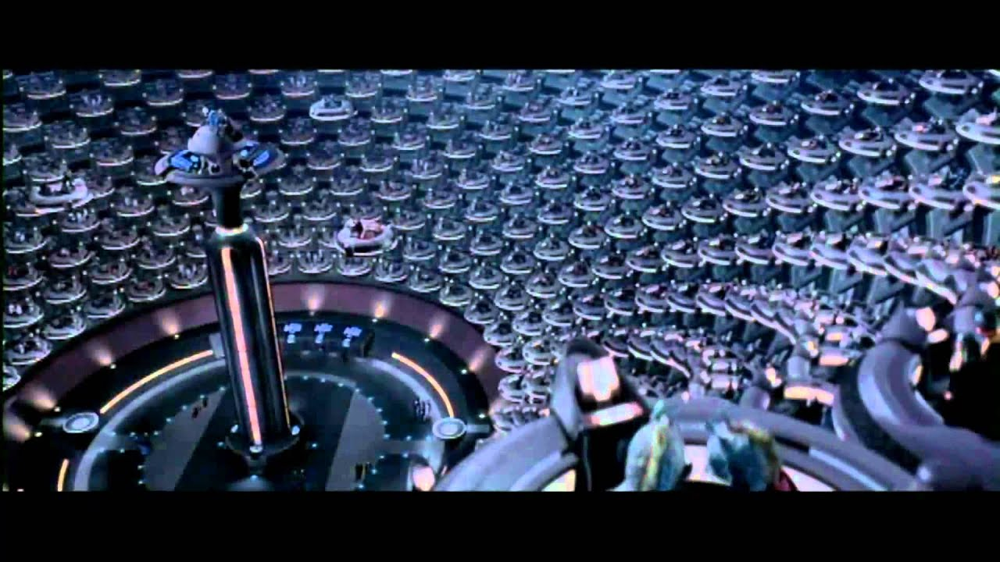

# World Parliament -- Khartoum Parliament of Free Representation
„*The Opinium Feature of any game you want*”

'The Greenlanders Want to .. ...'
Well.. Do they? How do you know?
Because you have two types of functions to inform you, and intelligence services more though roughly 3.
1. `♦(vote from persons) -> ♦(♣_{government / representatives}) -> 'This is what WE want'`
2. `♦(Random reach attempt at population considered 'one' sometimes a few dimensions of diversity classification) -> ♦_{representation of responses given schematic questionaires)`
3. `♦_{♣s leaving footprint in plenum of their publicized opinions)`

All these systems exhibit 'category of what you will and your voice IMPOSED upon you from outside'. I.e. you do not get to state: "No. That is not what I want, THIS is what I want, here is my or me & aligned persons representative (Can be Multaiddaemons) appearing in World Parliament".

## Chaos of Real-Time Variable Representation
The way to solve it, is through logarhythmic reductions of representatives in any matter humans have to deal with: dynamic discovery of suitable animaecracy in the human reductions or in terms of computer advantage variety: concrete reductions on any statements to be discussed to find suitable reductions for human consumption of 'landscape of persons'.

In terms of fully computerized variety, then no need to ever pool together will of anyone, but instead handling the divergent will of billions is small in petabyte or yotabyte computer landscape substrates.

## Why The World Powers Hate World Parliament
The Notion of having it be truely representatives at direct choice of who represent you all the way to yourself or any AI and so on; is heavily disempowering of the many power houses.
In part because they are well established in them (relative position) and in part because the relative becomes absolute positioning, where anyone can immediately change into more authentic representation and so disempowering of position they thought they had while position in institution was held.

Real dynamics of representation, instead of passing the bar, then holding institutional power.

## World Parliament Walked
*To Simply Make World Parliament. Asking all (At the individual level -- not aggregate) to provide their Representation Real Time Dynamically WITHOUT any leverage or decision making power. Merely as a input source for any one to use*

Then perhaps later, something like [GAIA](/?f=52) World Resource Strata to be funnelled into its leveraging power.

The suffering of their choice in representatives, having to accept Jay Z, Ed Sheeran, Kevin Hart and The Rock representatives for hundreds of millions.

It is not 'candidates to pick from'. It is, real time, any one on the planet, to designate as speaking on your behalf too. Whoever they are, however degree they bother dealing with the parliament or any serious matter. Moment to Moment. Dynamically. 

'Signed off that person with weight of those persons'.

You can imagine having a counter that can be expanded into 'less crude aggregation' in different perspectives. Then standing at Parliament speaking or holding a speech and seeing the real time choices be visible in that level of 'crude aggregation' relevant to you. (Like geographical, or particular selection of persons, or previous interest or whatever)

Weight as input for any other system.

Then given such efforts as GAIA strata, then the real consequences or power wielding is amplified. You can imagine having more power to wield directly or indirectly when domination of others is needed (Parliamentary compromise or overrule by the vote majority etc).
